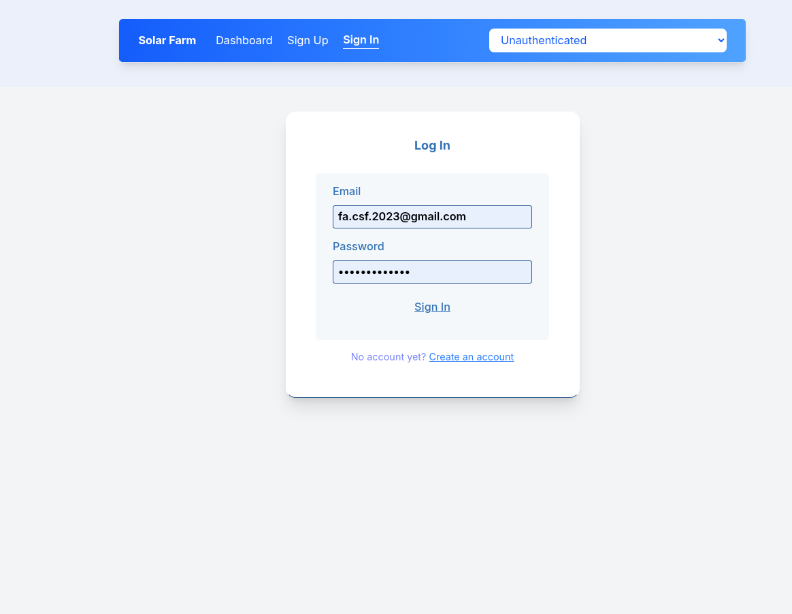
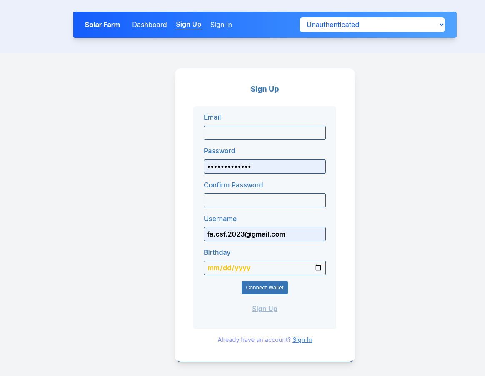
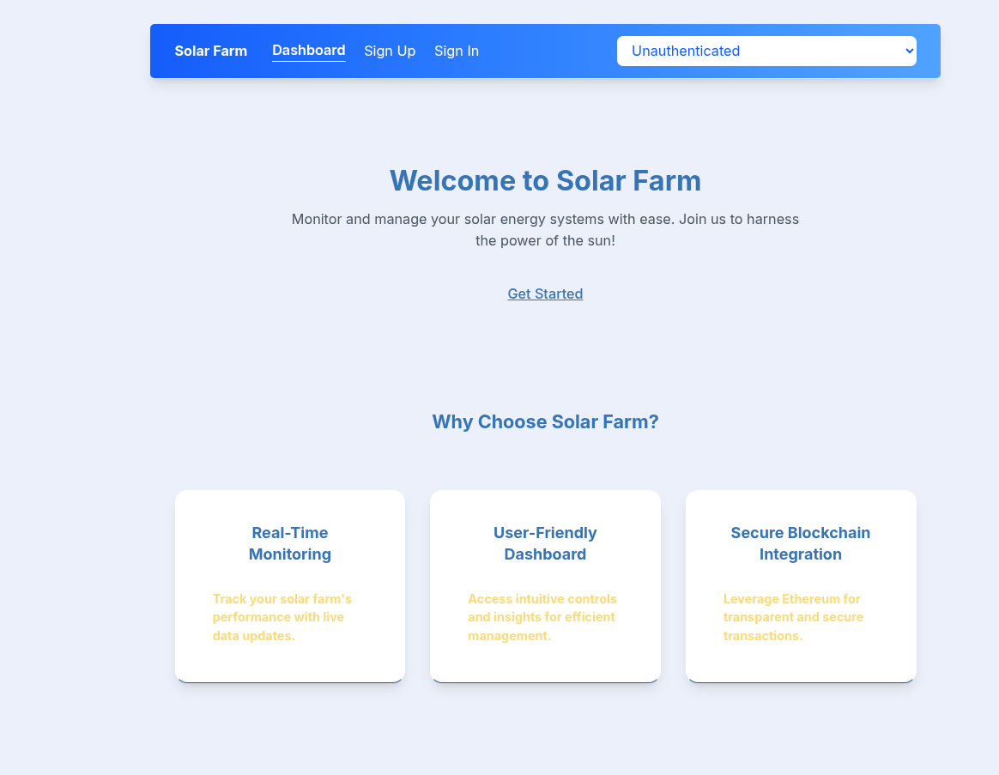
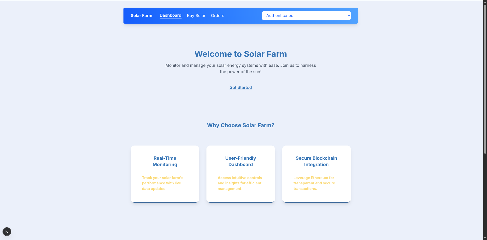
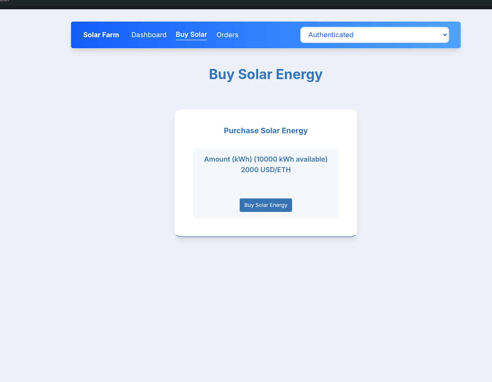
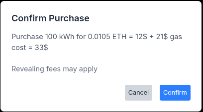
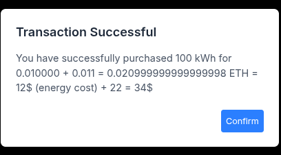
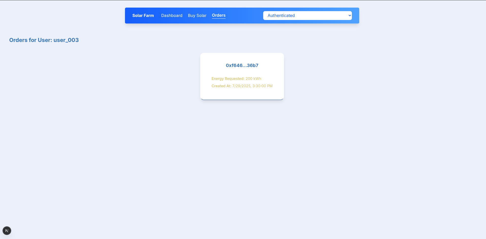

# EnergyContract

## Project Overview

**EnergyContract** is a Solidity smart contract for secure, transparent energy trading between a solar farm and authorized buyers on the Ethereum blockchain. It uses a commit-reveal scheme to ensure fair energy purchases (in kWh) and integrates with a Next.js frontend (`solarfarm_ui`) for user interaction, backed by Firebase for authentication and data storage. A business demo video is available on YouTube: [Solar Farm Business Demo](https://youtu.be/zD7AweB6VME). Key features include:

- **Energy Management**: Owners add energy with a delay (`ADD_ENERGY_DELAY`) via `addEnergy`.
- **Commit-Reveal Purchases**: Buyers use `commitPurchase` and `revealPurchase` within a `COMMIT_REVEAL_WINDOW` to prevent front-running.
- **Price Oracle**: Uses Chainlink’s ETH/USD price feed with a fallback (`cachedEthPrice`) for reliable payments.
- **Security**: Leverages OpenZeppelin’s `Ownable`, `Pausable`, and `ReentrancyGuard` for access control and attack prevention.
- **Refunds**: Supports overpayment refunds via `withdrawRefunds` with `nonReentrant`.
- **Gas Estimation**: Provides real-time gas cost estimates for purchases via `/buySolar` in `utils/contract.js`.
- **Documentation**: Includes Mermaid diagrams in `docs/diagrams/` and screenshots in `./screenshots/{businessDemo,technicalDemo,adminDemo}`.

<!-- Rewritten for clarity and conciseness while preserving all technical details -->

## Goals

- Deliver a secure, gas-efficient energy trading platform.
- Ensure transparency with events (e.g., `EnergyPurchased`, `RefundWithdrawn`).
- Mitigate risks using commit-reveal, reentrancy guards, and access controls.
- Enhance UX with clear gas and energy cost estimates.
- Support development with Hardhat, Remix, Next.js, Firebase, and AI tools (e.g., Grok).

## Business Mode User Flow

Authenticated and unauthenticated users interact with the platform to sign in, purchase energy, and view orders.

1. **Sign In (Unauthenticated)**  
   Users log in using Firebase credentials.  
   

2. **Sign Up (Unauthenticated)**  
   New users register with email, username, and other details.  
   

3. **Unauthenticated Dashboard**  
   Limited dashboard for unauthenticated users with sign-in/signup options.  
   

4. **Authenticated Dashboard**  
   Displays user-specific data and navigation after login.  
   

5. **Buy Solar Page**  
   Users enter kWh, view gas/energy cost estimates, and initiate purchases.  
   

6. **Confirm Commit**  
   Users review and confirm commit purchase details with gas estimates.  
   

7. **Confirm Reveal**  
   Users finalize purchases within the commit-reveal window.  
   

8. **Orders Page**  
   Displays purchase history with kWh and transaction details.  
   
## Technical Mode Web3 Integration

This flow outlines Web3 integration, from MetaMask wallet connection to smart contract interaction. A technical demo video is available on YouTube: [Solar Farm Technical Demo](https://youtu.be/HDbMywdJ6f8).

1. **MetaMask Connection**  
   Users connect MetaMask to the Hardhat testnet for blockchain interactions.  
   

2. **Commit Purchase**  
   Users initiate a commit purchase on `/buySolar`, entering kWh and triggering `commitPurchase` via MetaMask.  
   

3. **Reveal Purchase**  
   Users finalize the purchase in MetaMask within the commit-reveal window.  
   

<!-- Updated technical demo link to https://youtu.be/HDbMywdJ6f8 as requested -->

## Admin Dashboard Energy Management Interface

Admins (e.g., `alice.smith@example.com` from `dummyUsers`) manage energy trading via a dedicated interface.

1. **Admin Dashboard**  
   Overview and navigation for energy management tasks.  
   

2. **Add Energy Page**  
   Admins add energy using `requestAddEnergy` and `confirmAddEnergy`.  
   

3. **Update Price Page**  
   Admins update the energy price per kWh.  
   

4. **Manage Users Page**  
   Admins view and manage user accounts for trading authorization.  
   

5. **User Details Page**  
   Displays individual user details, like purchase history.  
   

6. **Manage Requests Page**  
   Admins handle pending energy addition or authorization requests.  
   

<!-- Simplified admin section for clarity while retaining all details -->

## Quick Start Guide

### Prerequisites

- **Node.js**: v18.x (e.g., v18.20.4). Install via [nodejs.org](https://nodejs.org/) or `nvm install 18 && nvm use 18`.
- **npm**: v9.x or later (included with Node.js).
- **MetaMask**: For Hardhat testnet interaction.
- **Firebase Account**: For authentication and database in `solarfarm_ui`.
- **VS Code**: Recommended with extensions:
  - Solidity (juanblanco.solidity)
  - Prettier (esbenp.prettier-vscode)
  - ESLint (dbaeumer.vscode-eslint)
  - Hardhat (nomicfoundation.hardhat-vscode)
  - DotENV (mikestead.dotenv)
  - Mermaid Preview (bierner.markdown-mermaid)
  - Tailwind CSS IntelliSense (bradlc.vscode-tailwindcss)
- **Browser Developer Tools**: Enable (F12) for gas estimation logs and Web3 debugging.

### Setup

1. **Clone Repository**
   ```bash
   git clone <repository-url>
   cd energy-contract
```

2. **Install Backend Dependencies**
    
    ```bash
    npm install
    ```
    
    Installs `hardhat@2.22.10`, `@nomicfoundation/hardhat-toolbox@5.0.0`, `@openzeppelin/contracts@5.0.2`, `@chainlink/contracts@0.8.0`, `dotenv@16.4.5`, `chai@4.5.0`.
    
3. **Configure Backend Environment**  
    Create `.env`:
    
    ```
    RPC_URL=http://127.0.0.1:8545
    PRIVATE_KEY=your_private_key_here
    ```
    
    - Use Hardhat’s testnet (`http://127.0.0.1:8545`).
    - Add test private key from Hardhat accounts.
    - Add `.env` to `.gitignore`.
4. **Install Frontend Dependencies**
    
    ```bash
    cd solarfarm_ui
    npm install
    ```
    
    Installs `next@15.0.1`, `firebase@10.14.1`, `firebase-admin@12.5.0`, `tailwindcss@3.4.14`.
    
5. **Configure Frontend Environment**  
    Create `solarfarm_ui/.env`:
    
    ```
    NEXT_PUBLIC_FIREBASE_API_KEY=your-api-key
    NEXT_PUBLIC_FIREBASE_AUTH_DOMAIN=your-auth-domain.firebaseapp.com
    NEXT_PUBLIC_FIREBASE_DATABASE_URL=https://your-database-name.firebaseio.com
    NEXT_PUBLIC_FIREBASE_PROJECT_ID=your-project-id
    NEXT_PUBLIC_FIREBASE_STORAGE_BUCKET=your-storage-bucket.appspot.com
    NEXT_PUBLIC_FIREBASE_MESSAGING_SENDER_ID=your-messaging-sender-id
    NEXT_PUBLIC_FIREBASE_APP_ID=your-app-id
    FIREBASE_PROJECT_ID=your-project-id
    FIREBASE_PRIVATE_KEY=your-private-key
    FIREBASE_CLIENT_EMAIL=your-client-email
    NEXT_PUBLIC_RPC_URL=http://127.0.0.1:8545
    NEXT_PUBLIC_CONTRACT_ADDRESS=your_contract_address
    NEXT_PUBLIC_PRICE_FEED_ADDRESS=your_price_feed_address
    ```
    
    - Obtain Firebase credentials from [console.firebase.google.com](https://console.firebase.google.com/).
    - Add `solarfarm_ui/.env` and `solarfarm_ui/*.json` to `.gitignore`.
    - Set `NEXT_PUBLIC_CONTRACT_ADDRESS` after deployment.
6. **Run Hardhat Node**
    
    ```bash
    npx hardhat node
    ```
    
7. **Deploy Contracts**
    
    ```bash
    npx hardhat run scripts/deploy.js --network hardhat
    ```
    
    Updates `solarfarm_ui/.env` with `CONTRACT_ADDRESS`.
    
8. **Run Frontend**
    
    ```bash
    cd solarfarm_ui
    npm run dev
    ```
    
    Access at [http://localhost:3000](http://localhost:3000/).
    
9. **Verify Gas Estimation and Web3**
    
    - Connect MetaMask to Hardhat testnet (localhost:8545).
    - On `/buySolar`, enter kWh (e.g., 20), click 'Estimate Costs', and check console logs (F12).
    - Ensure sufficient `availableKWh` via `requestAddEnergy`/`confirmAddEnergy`.
    - If 'Nonce too low' occurs, restart Hardhat node or set `mining: { auto: false, interval: 5000 }` in `hardhat.config.js`.

## Testing Instructions

### Test Suites

- **Unit Tests** (`test/unit/EnergyContract.test.js`): Tests `authorizeParty`, `commitPurchase`, `revealPurchase`, and edge cases.
- **Integration Tests** (`test/integration/FullFlow.test.js`): Tests full flow (`requestAddEnergy` → `confirmAddEnergy` → `commitPurchase` → `revealPurchase`).
- **Security Tests** (`test/security/SecurityTests.test.js`): Tests reentrancy, access control, and price manipulation.
- **Gas Estimation Tests**: Add to `test/unit/EnergyContract.test.js` for `estimateGasForCommitPurchase` and `estimateGasForRevealPurchase`.

### Running Tests

- **Compile Contracts**:
    
    ```bash
    npx hardhat compile
    ```
    
- **Run Tests**:
    
    ```bash
    npx hardhat test
    ```
    
    Or specific suites:
    
    ```bash
    npx hardhat test test/unit/EnergyContract.test.js
    ```
    
- **Check Gas Logs**: Review `console.log` outputs in `utils/contract.js`.
    

### Notes

- Use `hardhat-network-helpers` (`evm_increaseTime`) for time-based tests.
- Validate flows with `docs/diagrams/` and `./screenshots/{businessDemo,technicalDemo,adminDemo}`.

## Deployment Guide

### Local Deployment

1. **Start Hardhat Node**
    
    ```bash
    npx hardhat node
    ```
    
2. **Deploy Contracts**
    
    ```bash
    npx hardhat run scripts/deploy.js --network hardhat
    ```
    
3. **Deploy Frontend**
    
    ```bash
    cd solarfarm_ui
    npm run dev
    ```
    
4. **Verify**
    
    - Check console for contract addresses.
    - Test at [http://localhost:3000](http://localhost:3000/).
    - Validate gas estimation on `/buySolar` and admin functionality on `/admin/*` with an admin account (e.g., `alice.smith@example.com`).

## Visual Documentation

- **Diagrams (`docs/diagrams/`)**:
    - `contract-flow.mmd`: Contract function flow.
    - `contract-flow-security.mmd`: Security features.
    - `commit-reveal-state.mmd`: Commit-reveal states.
    - `login-flow.mmd`: Login sequence.
    - `purchase-energy-flow.mmd`: Purchase flow with gas estimation.
    - `add-energy-flow.mmd`: Add energy flow.
    - `update-price-flow.mmd`: Update price flow.
- **Render**: Use VS Code Mermaid Preview or [mermaid.live](https://mermaid.live/). View screenshots in markdown preview or directly.

## Contributing Guidelines

### How to Contribute

1. **Fork Repository**
    
    ```bash
    git clone <your-forked-repo-url>
    cd energy-contract
    ```
    
2. **Create Branch**
    
    ```bash
    git checkout -b feature/your-feature-name
    ```
    
3. **Make Changes**
    
    - Update `contracts/`, `test/`, `scripts/`, `solarfarm_ui/`, `docs/diagrams/`, or `./screenshots/`.
    - Format with Prettier.
    - Update tests, diagrams, and screenshots as needed.
    - Modify gas estimation in `utils/contract.js` if applicable.
4. **Test Changes**
    
    - Run `npx hardhat test`.
    - Test frontend with `npm run dev` in `solarfarm_ui`.
    - Validate diagrams and screenshots.
5. **Commit and Push**
    
    ```bash
    git commit -m "Add feature: your-feature-name"
    git push origin feature/your-feature-name
    ```
    
6. **Submit PR**
    
    - Target `main` branch.
    - Describe changes and update diagrams/screenshots.

### Code Standards

- Use Solidity 0.8.30 with OpenZeppelin best practices.
- Write modular tests with Mocha/Chai and Hardhat.
- Use React/Next.js with Tailwind CSS.
- Optimize gas usage in estimation functions.

### Issues and Bugs

- Report via GitHub Issues with logs.
- Use Remix AI for security issues.

## Security Considerations

- **Backend**: Secure `.env`, validate `SolarFarmABI.json`, test edge cases, protect gas inputs.
- **Frontend**: Secure Firebase credentials, validate admin actions, sanitize gas estimation inputs.
- **AI Usage**: Manually review AI-generated code (e.g., `OrderItem.jsx`).

## Changelog

- **August 20, 2025**: Updated technical demo YouTube link to `https://youtu.be/HDbMywdJ6f8` in Technical Mode Web3 Integration section (03:44 AM EEST).
- **August 05, 2025**: Added business demo video link (`https://youtu.be/zD7AweB6VME`) to Project Overview (10:39 AM EEST).
- **August 03, 2025**: Added Admin Dashboard Energy Management Interface section with screenshots in `./screenshots/adminDemo` (02:21 PM EEST).
- **August 03, 2025**: Added business mode user flow with screenshots in `./screenshots/businessDemo` (01:10 PM EEST).
- **July 30, 2025**: Added gas estimation for commit/reveal purchases with UI integration (11:55 AM EEST).