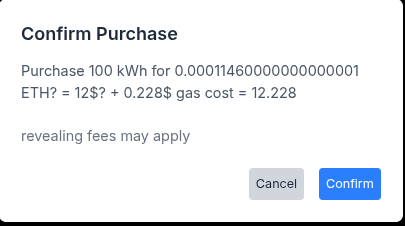

# EnergyContract

## Project Overview

**EnergyContract** is a Solidity smart contract designed to facilitate secure and transparent energy trading between a solar farm and authorized buyers on the Ethereum blockchain. It uses a commit-reveal scheme to ensure fairness and security for energy purchases (in kWh). The accompanying Next.js frontend (`solarfarm_ui`) provides a user-friendly interface, integrated with Firebase for authentication and data storage. A business demo video showcasing the platform is available on YouTube: [Solar Farm Business Demo](https://youtu.be/zD7AweB6VME). Key features include:

- **Energy Management**: Allows the solar farm owner to add energy with a delay (`ADD_ENERGY_DELAY`) via `addEnergy`.
- **Commit-Reveal Purchases**: Buyers commit (`commitPurchase`) and reveal (`revealPurchase`) within `COMMIT_REVEAL_WINDOW` to prevent front-running.
- **Price Oracle**: Integrates Chainlink’s ETH/USD price feed with a cached fallback (`cachedEthPrice`) for payment accuracy.
- **Security**: Uses OpenZeppelin’s Ownable, Pausable, and ReentrancyGuard to protect against unauthorized access and reentrancy attacks.
- **Refund Mechanism**: Supports overpayment refunds via `withdrawRefunds` with `nonReentrant`.
- **Gas Estimation**: Offers real-time gas cost estimates for commit and reveal purchases via the `/buySolar` UI, using `utils/contract.js`.
- **Visual Documentation**: Includes Mermaid diagrams in `docs/diagrams/` and screenshots in `./screenshots/buisnessDemo`, `./screenshots/technicalDemo`, and `./screenshots/adminDemo` for contract and frontend flows.

## Goals

- Provide a secure, gas-efficient energy trading platform.
- Ensure transparency with event emissions (e.g., `EnergyPurchased`, `RefundWithdrawn`).
- Mitigate risks using best practices (e.g., commit-reveal, reentrancy guards).
- Enhance user experience with transparent gas and energy cost estimates.
- Support development and testing with Hardhat, Remix, Next.js, Firebase, and AI tools (e.g., Grok).

## Business Mode User Flow

The business mode user flow guides users through the process of logging in, accessing the dashboard, purchasing energy, estimating costs, and viewing orders.

1. **Sign In (Unauthenticated)**  
    Users start at the sign-in page to authenticate using Firebase credentials.  
    
    
2. **Sign Up (Unauthenticated)**  
    New users can create an account by providing email, username, and other details.  
    
    
3. **Unauthenticated Dashboard**  
    Unauthenticated users see a limited dashboard with options to sign in or sign up.  
    
    
4. **Dashboard (Authenticated)**  
    After logging in, users access the main dashboard showing user-specific data and navigation options.  
    
    
5. **Buy Solar Page**  
    Users navigate to purchase energy, entering kWh and viewing gas and energy cost estimates.  
    
    
6. **Confirm Commit**  
    Users confirm their commit purchase, reviewing transaction details and gas estimates.  
    
    
7. **Confirm Reveal**  
    Users reveal their purchase within the commit-reveal window to finalize the transaction.  
    
    
8. **Orders Page**  
    Users view their purchase history, including details like kWh and transaction status.  
    
    

## Technical Mode Web3 Integration

The technical mode user flow demonstrates the Web3 integration process, from connecting a MetaMask wallet to interacting with the `EnergyContract` smart contract for commit and reveal purchases. A technical demo video showcasing this flow is available on YouTube: [Solar Farm Technical Demo](https://youtu.be/8ACRl62QvUg). Below is the sequence with embedded screenshots from `./screenshots/technicalDemo`:

1. **MetaMask Connection**  
    Users connect their MetaMask wallet to the Hardhat testnet to enable blockchain interactions.  
    
    
2. **Commit Purchase**  
    Users initiate a commit purchase on the `/buySolar` page, entering kWh, viewing gas estimates, and triggering the `commitPurchase` function via MetaMask.  
    
    
3. **Reveal Purchase**  
    Users confirm the reveal step in MetaMask within the commit-reveal window, finalizing the purchase with gas cost details.  
    
    

## Admin Dashboard Energy Management Interface

The admin dashboard energy management interface allows authorized admin users (e.g., `alice.smith@example.com` from `dummyUsers`) to manage energy trading operations, including adding energy, updating prices, managing users, and handling requests. Below is the sequence with embedded screenshots from `./screenshots/adminDemo`:

1. **Admin Dashboard**  
    The main admin dashboard provides an overview and navigation to energy management tasks.  
    
    
2. **Add Energy Page**  
    Admins add energy to the contract using `requestAddEnergy` and `confirmAddEnergy`, specifying kWh amounts.  
    
    
3. **Update Price Page**  
    Admins update the energy price per kWh, interacting with the contract’s pricing mechanism.  
    
    
4. **Manage Users Page**  
    Admins view and manage user accounts, including authorization for energy trading.  
    
    
5. **User Details Page**  
    Admins view detailed information about individual users, such as purchase history and account status.  
    
    
6. **Manage Requests Page**  
    Admins handle pending requests, such as energy addition or user authorization requests.  
    
    

## Quick Start Guide

### Prerequisites

- **Node.js**: v18.x (e.g., v18.20.4). Install via [nodejs.org](https://nodejs.org/) or `nvm: nvm install 18 && nvm use 18`.
- **npm**: v9.x or later (bundled with Node.js).
- **MetaMask**: For Hardhat testnet interaction (required for Web3 integration).
- **Firebase Account**: For `solarfarm_ui` authentication and database.
- **VS Code**: Recommended with extensions:
    - Solidity (juanblanco.solidity)
    - Prettier (esbenp.prettier-vscode)
    - ESLint (dbaeumer.vscode-eslint)
    - Hardhat (nomicfoundation.hardhat-vscode)
    - DotENV (mikestead.dotenv)
    - Mermaid Preview (bierner.markdown-mermaid)
    - Tailwind CSS IntelliSense (bradlc.vscode-tailwindcss)
- **Browser Developer Tools**: Enable (F12) to inspect gas estimation logs and Web3 interactions.

### Setup

1. **Clone the Repository**
    
    ```bash
    git clone <repository-url>
    cd energy-contract
    ```
    
2. **Install Backend Dependencies**
    
    ```bash
    npm install
    ```
    
    Installs `hardhat@2.22.10`, `@nomicfoundation/hardhat-toolbox@5.0.0`, `@openzeppelin/contracts@5.0.2`, `@chainlink/contracts@0.8.0`, `dotenv@16.4.5`, and `chai@4.5.0`.
    
3. **Configure Backend Environment**  
    Create a `.env` file:
    
    ```
    RPC_URL=http://127.0.0.1:8545
    PRIVATE_KEY=your_private_key_here
    ```
    
    - Use `http://127.0.0.1:8545` for Hardhat.
    - Replace with a test private key (e.g., from Hardhat accounts).
    - Add `.env` to `.gitignore`.
4. **Install Frontend Dependencies**
    
    ```bash
    cd solarfarm_ui
    npm install
    ```
    
    Installs `next@15.0.1`, `firebase@10.14.1`, `firebase-admin@12.5.0`, `tailwindcss@3.4.14`, and others.
    
5. **Configure Frontend Environment**  
    Create `solarfarm_ui/.env`:
    
    ```
    NEXT_PUBLIC_FIREBASE_API_KEY=your-api-key
    NEXT_PUBLIC_FIREBASE_AUTH_DOMAIN=your-auth-domain.firebaseapp.com
    NEXT_PUBLIC_FIREBASE_DATABASE_URL=https://your-database-name.firebaseio.com
    NEXT_PUBLIC_FIREBASE_PROJECT_ID=your-project-id
    NEXT_PUBLIC_FIREBASE_STORAGE_BUCKET=your-storage-bucket.appspot.com
    NEXT_PUBLIC_FIREBASE_MESSAGING_SENDER_ID=your-messaging-sender-id
    NEXT_PUBLIC_FIREBASE_APP_ID=your-app-id
    FIREBASE_PROJECT_ID=your-project-id
    FIREBASE_PRIVATE_KEY=your-private-key
    FIREBASE_CLIENT_EMAIL=your-client-email
    NEXT_PUBLIC_RPC_URL=http://127.0.0.1:8545
    NEXT_PUBLIC_CONTRACT_ADDRESS=your_contract_address
    NEXT_PUBLIC_PRICE_FEED_ADDRESS=your_price_feed_address
    ```
    
    - Get Firebase credentials from [console.firebase.google.com](https://console.firebase.google.com/).
    - Add `solarfarm_ui/.env` and `solarfarm_ui/*.json` to `.gitignore`.
    - Ensure `NEXT_PUBLIC_CONTRACT_ADDRESS` matches the Hardhat deployment.
6. **Run Hardhat Node**
    
    ```bash
    npx hardhat node
    ```
    
7. **Deploy Contracts**
    
    ```bash
    npx hardhat run scripts/deploy.js --network hardhat
    ```
    
    Updates `solarfarm_ui/.env` with the deployed `CONTRACT_ADDRESS`.
    
8. **Run Frontend**
    
    ```bash
    cd solarfarm_ui
    npm run dev
    ```
    
    Access at [http://localhost:3000](http://localhost:3000/).
    
9. **Verify Gas Estimation and Web3 Integration**
    
    - Connect MetaMask to Hardhat testnet (localhost:8545).
    - Navigate to `/buySolar`, enter an amount (e.g., 20 kWh), and click 'Estimate Costs'.
    - Check console logs (F12) for gas estimates. Ensure sufficient `availableKWh` (add via `requestAddEnergy` and `confirmAddEnergy`).
    - If 'Nonce too low' occurs, restart `npx hardhat node` or use `mining: { auto: false, interval: 5000 }` in `hardhat.config.js`.

## Testing Instructions

### Test Suites

- **Unit Tests (`test/unit/EnergyContract.test.js`)**: Tests functions (`authorizeParty`, `commitPurchase`, `revealPurchase`, etc.) and edge cases.
- **Integration Tests (`test/integration/FullFlow.test.js`)**: Tests full flow (`requestAddEnergy` → `confirmAddEnergy` → `commitPurchase` → `revealPurchase`).
- **Security Tests (`test/security/SecurityTests.test.js`)**: Tests reentrancy, access control, and price manipulation.
- **Gas Estimation Tests**: Add to `test/unit/EnergyContract.test.js` to verify `estimateGasForCommitPurchase` and `estimateGasForRevealPurchase` with edge cases (e.g., `InsufficientEnergyAvailable`).

### Running Tests

- **Compile Contracts**:
    
    ```bash
    npx hardhat compile
    ```
    
- **Run Tests**:
    
    ```bash
    npx hardhat test
    ```
    
    Or specific suites:
    
    ```bash
    npx hardhat test test/unit/EnergyContract.test.js
    ```
    
- **Check Gas Logs**: Use `console.log` outputs in `utils/contract.js` for gas estimation.
    

### Notes

- Use `hardhat-network-helpers` (`evm_increaseTime`) for time-based tests.
- Validate flows against `docs/diagrams/` and `./screenshots/{buisnessDemo,technicalDemo,adminDemo}`.

## Deployment Guide

### Local Deployment

1. **Start Hardhat Node**
    
    ```bash
    npx hardhat node
    ```
    
2. **Deploy Contracts**
    
    ```bash
    npx hardhat run scripts/deploy.js --network hardhat
    ```
    
3. **Deploy Frontend**
    
    ```bash
    cd solarfarm_ui
    npm run dev
    ```
    
4. **Verify**
    
    - Check console for addresses.
    - Test at [http://localhost:3000](http://localhost:3000/).
    - Validate gas estimation and Web3 interactions on `/buySolar`.
    - Verify admin functionality on `/admin/*` pages using an admin account (e.g., `alice.smith@example.com`).

## Visual Documentation

- **Diagrams (`docs/diagrams/`)**:
    - `contract-flow.mmd`: Contract function flow.
    - `contract-flow-security.mmd`: Security features.
    - `commit-reveal-state.mmd`: Commit-reveal states.
    - `login-flow.mmd`: Login sequence.
    - `purchase-energy-flow.mmd`: Purchase flow with gas estimation.
    - `add-energy-flow.mmd`: Add energy flow.
    - `update-price-flow.mmd`: Update price flow.
- **Render**: Use VS Code Mermaid Preview or [mermaid.live](https://mermaid.live/) for diagrams. View screenshots in markdown preview or directly.

## Contributing Guidelines

### How to Contribute

1. **Fork the Repository**
    
    ```bash
    git clone <your-forked-repo-url>
    cd energy-contract
    ```
    
2. **Create a Branch**
    
    ```bash
    git checkout -b feature/your-feature-name
    ```
    
3. **Make Changes**
    
    - Update `contracts/`, `test/`, `scripts/`, `solarfarm_ui/`, `docs/diagrams/`, or `./screenshots/{buisnessDemo,technicalDemo,adminDemo}`.
    - Format with Prettier.
    - Update tests, diagrams, and screenshots if needed.
    - Modify gas estimation in `utils/contract.js` or tests if applicable.
4. **Test Changes**
    
    - Run `npx hardhat test`.
    - Test frontend with `npm run dev` in `solarfarm_ui`.
    - Validate diagrams and screenshots.
5. **Commit and Push**
    
    ```bash
    git commit -m "Add feature: your-feature-name"
    git push origin feature/your-feature-name
    ```
    
6. **Submit a PR**
    
    - Open against `main`.
    - Describe changes and update diagrams/screenshots.

### Code Standards

- Use Solidity 0.8.30 and OpenZeppelin practices.
- Write modular tests with Mocha/Chai and Hardhat.
- Use React/Next.js and Tailwind CSS.
- Optimize gas usage in gas estimation functions.

### Issues and Bugs

- Report via GitHub Issues with logs.
- Use Remix AI for security issues.

## Security Considerations

- **Backend**: Protect `.env`, validate `SolarFarmABI.json`, test edge cases, secure gas inputs.
- **Frontend**: Secure Firebase credentials, validate admin actions, sanitize gas estimation inputs.
- **AI Usage**: Review AI-generated code (e.g., `OrderItem.jsx`) manually.

## Changelog

- **August 05, 2025**: Added YouTube technical demo video link ([https://youtu.be/8ACRl62QvUg](https://youtu.be/8ACRl62QvUg)) to Technical Mode Web3 Integration section in README (10:52 AM EEST).
- **August 05, 2025**: Added YouTube business demo video link ([https://youtu.be/zD7AweB6VME](https://youtu.be/zD7AweB6VME)) to Project Overview section in README (10:39 AM EEST).
- **August 03, 2025**: Added Admin Dashboard Energy Management Interface section to README with screenshots (`adminDashboard.png`, `addEnergyPage.png`, `UpdatePricePage.png`, `manageUsersPage.png`, `userDetailsPage.png`, `requestsPage.png`) in `./screenshots/adminDemo` with clear captions (02:21 PM EEST).
- **August 03, 2025**: Updated Technical Mode Web3 Integration section in README to include specific placeholders for MetaMask commit and reveal screenshots (`commitPurchase.png`, `revealPurchase.png`) in `./screenshots/technicalDemo` with clear captions (02:13 PM EEST).
- **August 03, 2025**: Embedded screenshots with clear captions in the Business Mode User Flow section of README.md (01:15 PM EEST).
- **August 03, 2025**: Added business mode user flow with screenshots in `./screenshots/buisnessDemo` (signin, signup, unauthDashboard, buysolarPage, confirmCommit, confirmReveal, ordersPage) to README (01:10 PM EEST).
- **July 30, 2025**: Added gas estimation feature for commit and reveal purchases, including UI integration and error handling (11:55 AM EEST).