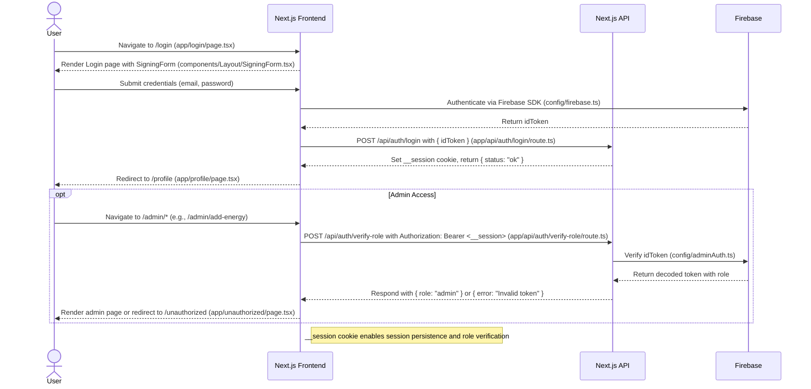

# Next.js API Documentation (solarfarm_ui)

## Overview

The `solarfarm_ui` Next.js application (version 15.0.1) provides an API layer under `app/api/auth/` to manage server-side logic for **authentication**, **session management**, and **role-based access control**. These APIs power the `EnergyContract` energy trading platform by integrating with **Firebase Authentication** (`config/firebase.ts`, `config/adminAuth.ts`) and the Ethereum blockchain (`utils/contract.ts`, `SolarFarmABI.json`). The endpoints enable critical frontend flows, including user login (`/login`), energy purchasing (`/buySolar`), and admin actions (`/admin/add-energy`, `/admin/update-price`). This document details the `/api/auth/login` and `/api/auth/verify-role` endpoints, covering their implementation, usage, and integration with the frontend and Firebase.

### Goals

- **Secure Authentication**: Validate Firebase ID tokens and manage sessions to ensure authorized access.
- **Role-Based Access Control**: Verify user roles (`user`, `admin`) to restrict admin-specific actions.
- **Seamless Integration**: Support frontend flows with `EnergyContract` and Firebase Realtime Database.
- **Maintainability**: Leverage Next.js App Router API routes for modular, serverless-compatible endpoints.
- **Security**: Protect sensitive data (e.g., Firebase credentials, session cookies) and implement robust error handling.

## API Structure

The API resides in the `solarfarm_ui/app/api/auth/` directory, utilizing Next.js App Router API routes. The implemented endpoints are:

- `/api/auth/login` (`app/api/auth/login/route.ts`): Authenticates users and sets a `__session` cookie with a Firebase ID token.
- `/api/auth/verify-role` (`app/api/auth/verify-role/route.ts`): Verifies a user’s role using a Firebase ID token for access control.

### Directory Structure

```
solarfarm_ui/
├── app/
│   ├── api/
│   │   ├── auth/
│   │   │   ├── login/
│   │   │   │   └── route.ts
│   │   │   ├── verify-role/
│   │   │   │   └── route.ts
│   ├── admin/
│   │   ├── add-energy/
│   │   │   ├── page.tsx
│   │   │   ├── ProgressBar.tsx
│   │   │   └── progress.module.css
│   │   ├── update-price/
│   │   │   └── page.tsx
│   │   ├── page.tsx
│   │   ├── TransactionItem.tsx
│   │   ├── TransactionList.tsx
│   ├── buySolar/
│   │   └── page.tsx
│   ├── components/
│   │   ├── Layout/
│   │   │   ├── Card.tsx
│   │   │   ├── Model.tsx
│   │   │   ├── Navbar.tsx
│   │   │   ├── SigningForm.tsx
│   │   ├── UI/
│   │   │   ├── NavLink.tsx
│   │   │   ├── PrimaryButton.tsx
│   │   │   ├── UnderlineButton.tsx
│   ├── login/
│   │   └── page.tsx
│   ├── orders/
│   │   ├── OrderItem.tsx
│   │   ├── OrdersList.tsx
│   │   └── page.tsx
│   ├── profile/
│   │   └── page.tsx
│   ├── signup/
│   │   └── page.tsx
│   ├── store/
│   │   └── index.tsx
│   ├── unauthorized/
│   │   └── page.tsx
│   ├── updateProfile/
│   │   └── page.tsx
│   ├── layout.tsx
│   ├── page.tsx
├── config/
│   ├── adminAuth.ts
│   ├── firebase.ts
│   ├── MockPriceABI.json
│   ├── SolarFarmABI.json
├── models/
│   ├── commitedOrders.ts
│   ├── transaction.ts
│   ├── user.ts
├── utils/
│   ├── contract.ts
│   ├── databaseUtils.ts
│   ├── tools.ts
├── public/
│   ├── *.svg
│   ├── homeimage.jpeg
├── .env
├── firebase.json
├── tailwind.config.ts
├── package.json
```

## Endpoint: /api/auth/login

The `/api/auth/login` endpoint (`app/api/auth/login/route.ts`) authenticates users by accepting a Firebase ID token and setting a `__session` cookie. It is called by the `/login` page (`app/login/page.tsx`) to establish a user session after Firebase Authentication.

### Source Code

```typescript
import { NextResponse } from "next/server";

export async function POST(req: Request) {
  const { idToken } = await req.json();
  if (!idToken) {
    return NextResponse.json({ error: "Missing token" }, { status: 400 });
  }

  const res = NextResponse.json({ status: "ok" });

  // Set the cookie — must be "__session"
  res.cookies.set("__session", idToken, {
    httpOnly: true,
    secure: process.env.NODE_ENV === "production",
    path: "/",
    maxAge: 60 * 60 * 24, // 1 day
    sameSite: "strict",
  });

  return res;
}
```

### Endpoint Details

- **Path**: `/api/auth/login`
- **Method**: `POST`
- **Purpose**: Sets a session cookie (`__session`) with a Firebase ID token for authenticated user sessions.
- **Dependencies**:
    - **Next.js** (`next/server`): Uses `NextResponse` for response and cookie handling.
    - **Firebase Authentication** (`config/firebase.ts`): Assumes `idToken` is generated client-side (e.g., via `signInWithEmailAndPassword`).
- **Request**:
    - **Headers**: None required.
    - **Body**:
        
        ```json
        { "idToken": "<firebase-id-token>" }
        ```
        
        - `idToken`: Firebase ID token from client-side authentication.
- **Responses**:
    - **Success (200)**:
        
        ```json
        { "status": "ok" }
        ```
        
        - Sets `__session` cookie with attributes:
            - `httpOnly: true`: Prevents client-side JavaScript access.
            - `secure`: Enabled in production (`process.env.NODE_ENV === "production"`).
            - `path: "/"`: Available across all routes.
            - `maxAge: 86400`: Expires after 1 day.
            - `sameSite: "strict"`: Restricts to same-site requests.
    - **Error (400)**:
        
        ```json
        { "error": "Missing token" }
        ```
        
        - Returned if `idToken` is missing.
- **Usage**:
    - Called by `/login` (`app/login/page.tsx`) after Firebase authentication via `SigningForm.tsx` (`components/Layout/SigningForm.tsx`).
    - The `__session` cookie is used for subsequent requests to `/api/auth/verify-role`.
- **Notes**:
    - Lacks server-side `idToken` verification; consider adding `adminAuth.verifyIdToken` (`config/adminAuth.ts`) for security.
    - Response is minimal; additional user data (e.g., `uid`, `email`) could be included if needed.

## Endpoint: /api/auth/verify-role

The `/api/auth/verify-role` endpoint (`app/api/auth/verify-role/route.ts`) verifies a user’s role by validating a Firebase ID token from the `Authorization` header, ensuring access control for admin routes (e.g., `/admin/add-energy`, `/admin/update-price`).

### Source Code

```typescript
import { adminAuth as admin } from "@/config/adminAuth";

export async function POST(req: Request) {
  const token = req.headers.get("authorization")?.split("Bearer ")[1];
  if (!token) {
    return new Response(JSON.stringify({ error: "No token provided" }), {
      status: 401,
      headers: { "Content-Type": "application/json" },
    });
  }

  try {
    const decodedToken = await admin.verifyIdToken(token);
    return new Response(
      JSON.stringify({ role: decodedToken.role || "user" }),
      {
        status: 200,
        headers: { "Content-Type": "application/json" },
      }
    );
  } catch (err) {
    console.error("Token verification error:", err);
    return new Response(JSON.stringify({ error: "Invalid token" }), {
      status: 401,
      headers: { "Content-Type": "application/json" },
    });
  }
}

export async function GET(req: Request) {
  const token = req.headers.get("authorization")?.split("Bearer ")[1];
  console.log("Verifying role");
  if (!token) {
    return new Response(JSON.stringify({ error: "No token provided" }), {
      status: 401,
      headers: { "Content-Type": "application/json" },
    });
  }

  try {
    const decodedToken = await admin.verifyIdToken(token);
    return new Response(
      JSON.stringify({ role: decodedToken.role || "user" }),
      {
        status: 200,
        headers: { "Content-Type": "application/json" },
      }
    );
  } catch (err) {
    console.error("Token verification error:", err);
    return new Response(JSON.stringify({ error: "Invalid token" }), {
      status: 401,
      headers: { "Content-Type": "application/json" },
    });
  }
}
```

### Endpoint Details

- **Path**: `/api/auth/verify-role`
- **Methods**: `GET`, `POST`
- **Purpose**: Verifies a Firebase ID token and returns the user’s role (`user` or `admin`).
- **Dependencies**:
    - **Firebase Admin SDK** (`config/adminAuth.ts`): Uses `adminAuth.verifyIdToken` for token validation.
    - **Firebase Authentication**: Assumes Email/Password or Google authentication.
- **Request**:
    - **Headers**:
        - `Authorization: Bearer <firebase-id-token>` (typically the `__session` cookie value).
    - **Body**: None.
- **Responses**:
    - **Success (200)**:
        
        ```json
        { "role": "user" }
        ```
        
        or
        
        ```json
        { "role": "admin" }
        ```
        
        - Returns the `role` claim, defaulting to `"user"`.
    - **Error (401)**:
        
        ```json
        { "error": "No token provided" }
        ```
        
        or
        
        ```json
        { "error": "Invalid token" }
        ```
        
        - Returned for missing or invalid tokens.
- **Error Handling**:
    - Logs errors to the console for debugging.
    - Returns 401 for invalid or missing tokens.
- **Usage**:
    - Called by admin pages (`/admin/add-energy`, `/admin/update-price`) to verify admin privileges.
    - Uses the `__session` cookie set by `/api/auth/login`.

## Sequence Diagram

The following Mermaid sequence diagram illustrates the API flow for authentication and role verification, integrating `/api/auth/login` and `/api/auth/verify-role`. It is stored as `docs/diagrams/api-flow.mmd`.



## Setup Instructions

1. **Firebase Configuration**:
    
    - Create a Firebase project at [console.firebase.google.com](https://console.firebase.google.com/).
    - Enable **Email/Password** and/or **Google** authentication in **Build > Authentication**.
    - Create a **Realtime Database** in **Build > Realtime Database** with test mode rules:
        
        ```json
        {
          "rules": {
            ".read": "auth != null",
            ".write": "auth != null"
          }
        }
        ```
        
    - Download the Firebase Admin SDK service account key and save as `solarfarm_ui/solarfarmsystem-firebase-adminsdk-fbsvc-b3714a635d.json`.
    - Configure `solarfarm_ui/.env`:
        
        ```plaintext
        NEXT_PUBLIC_FIREBASE_API_KEY=your-api-key
        NEXT_PUBLIC_FIREBASE_AUTH_DOMAIN=your-auth-domain.firebaseapp.com
        NEXT_PUBLIC_FIREBASE_DATABASE_URL=https://your-database-name.firebaseio.com
        NEXT_PUBLIC_FIREBASE_PROJECT_ID=your-project-id
        NEXT_PUBLIC_FIREBASE_STORAGE_BUCKET=your-storage-bucket.appspot.com
        NEXT_PUBLIC_FIREBASE_MESSAGING_SENDER_ID=your-messaging-sender-id
        NEXT_PUBLIC_FIREBASE_APP_ID=your-app-id
        FIREBASE_PROJECT_ID=your-project-id
        FIREBASE_PRIVATE_KEY=your-private-key
        FIREBASE_CLIENT_EMAIL=your-client-email
        ```
        
2. **Install Dependencies**:
    
    ```bash
    cd solarfarm_ui
    npm install
    ```
    
    Installs `next@15.0.1`, `firebase@10.14.1`, `firebase-admin@12.5.0`, and dependencies per `package.json`.
    
3. **Run the Application**:
    
    ```bash
    npm run dev
    ```
    
    Access at `http://localhost:3000`.
    
4. **Secure Sensitive Files**:
    
    - Ensure `.gitignore` includes:
        
        ```plaintext
        .env
        *.json
        ```
        

## Testing Instructions

### Manual Testing

1. **Test /api/auth/login**:
    
    - **Setup**:
        - Authenticate via `/login` (`app/login/page.tsx`) using Firebase (e.g., `signInWithEmailAndPassword`).
        - Capture the `idToken` from browser dev tools (network requests or `localStorage`).
    - **Test Cases**:
        - **Valid Token**:
            
            ```bash
            curl -X POST -H "Content-Type: application/json" -d '{"idToken": "<firebase-id-token>"}' http://localhost:3000/api/auth/login
            ```
            
            - Expect: `200`, `{ "status": "ok" }`, `__session` cookie in response headers.
        - **Missing Token**:
            
            ```bash
            curl -X POST -H "Content-Type: application/json" -d '{}' http://localhost:3000/api/auth/login
            ```
            
            - Expect: `400`, `{ "error": "Missing token" }`.
    - **Verify Cookie**:
        - Check browser dev tools for `__session` cookie (attributes: `httpOnly`, `secure` in production, `maxAge=86400`, `sameSite=strict`).
2. **Test /api/auth/verify-role**:
    
    - **Setup**:
        - Log in to obtain a `__session` cookie.
        - Set an admin user via `setInitialAdmin.ts` or Firebase Console (`role: admin` claim).
    - **Test Cases**:
        - **Valid Admin Token**:
            
            ```bash
            curl -H "Authorization: Bearer <firebase-id-token>" http://localhost:3000/api/auth/verify-role
            ```
            
            - Expect: `200`, `{ "role": "admin" }`.
        - **Valid User Token**:
            - Use a non-admin token.
            - Expect: `200`, `{ "role": "user" }`.
        - **No Token**:
            - Omit `Authorization` header.
            - Expect: `401`, `{ "error": "No token provided" }`.
        - **Invalid Token**:
            - Use an invalid/expired token.
            - Expect: `401`, `{ "error": "Invalid token" }`.
    - **Tools**: Use Postman or `curl`.
3. **Integration Testing**:
    
    - Navigate to `/login`, authenticate, and verify redirection to `/profile` (`app/profile/page.tsx`).
    - Access `/admin/add-energy` as an admin; confirm `/api/auth/verify-role` returns `{ "role": "admin" }` and page loads.
    - Test non-admin access; expect redirection to `/unauthorized` (`app/unauthorized/page.tsx`).
    - Inspect API calls and `__session` cookie in browser dev tools.

### Automated Testing

- Add tests in `solarfarm_ui/tests/` using Jest/Playwright with TypeScript:
    
    ```typescript
    // solarfarm_ui/tests/api/login.test.ts
    import fetch from 'node-fetch';
    
    describe('POST /api/auth/login', () => {
      it('should set __session cookie for valid idToken', async () => {
        const response = await fetch('http://localhost:3000/api/auth/login', {
          method: 'POST',
          headers: { 'Content-Type': 'application/json' },
          body: JSON.stringify({ idToken: '<valid-id-token>' }),
        });
        const data = await response.json();
        expect(response.status).toBe(200);
        expect(data.status).toBe('ok');
        expect(response.headers.get('set-cookie')).toContain('__session');
      });
    
      it('should return error for missing idToken', async () => {
        const response = await fetch('http://localhost:3000/api/auth/login', {
          method: 'POST',
          headers: { 'Content-Type': 'application/json' },
          body: JSON.stringify({}),
        });
        const data = await response.json();
        expect(response.status).toBe(400);
        expect(data.error).toBe('Missing token');
      });
    });
    
    // solarfarm_ui/tests/api/verify-role.test.ts
    describe('POST /api/auth/verify-role', () => {
      it('should return admin role for valid admin token', async () => {
        const response = await fetch('http://localhost:3000/api/auth/verify-role', {
          method: 'POST',
          headers: { 'Authorization': 'Bearer <admin-token>' },
        });
        const data = await response.json();
        expect(response.status).toBe(200);
        expect(data.role).toBe('admin');
      });
    });
    ```
    
- Run tests:
    
    ```bash
    cd solarfarm_ui
    npm test
    ```
    

## Integration with EnergyContract

- **/api/auth/login**:
    - Enables authentication for protected routes (`/buySolar`, `/orders`).
    - Sets `__session` cookie for role verification and `EnergyContract` interactions (`utils/contract.ts`, `commitPurchase`, `revealPurchase`).
    - Supports `docs/diagrams/purchase-energy-flow.mmd`.
- **/api/auth/verify-role**:
    - Secures admin actions (`addEnergy`, `updatePrice`) by verifying admin role.
    - Used in `docs/diagrams/add-energy-flow.mmd` and `docs/diagrams/update-price-flow.mmd`.

## Security Considerations

- **Firebase Credentials**:
    - Protect `solarfarmsystem-firebase-adminsdk-fbsvc-b3714a635d.json` and `.env` in `.gitignore`.
    - Use environment variables for Firebase config (`NEXT_PUBLIC_FIREBASE_*`, `FIREBASE_*`).
- **Token Validation**:
    - **/api/auth/login**: Add server-side `idToken` verification using `adminAuth.verifyIdToken` (`config/adminAuth.ts`).
    - **/api/auth/verify-role**: Provides robust token validation.
- **Cookie Security**:
    - `__session` uses `httpOnly`, `secure` (in production), and `sameSite: strict`.
    - Consider shorter `maxAge` (e.g., 1 hour) for sensitive applications.
- **Role Management**:
    - Set custom claims (`role: admin`) via `setInitialAdmin.ts` or Firebase Console.
- **Error Logging**:
    - Replace console logs in `/api/auth/verify-role` with a logging service (e.g., Winston).
- **Rate Limiting**:
    - Apply to both endpoints via Next.js middleware or Vercel.
- **CORS**:
    - Restrict API routes to frontend origin in `next.config.ts`.

## Contributing Guidelines

1. **Add New Endpoints**:
    - Create routes in `app/api/auth/` (e.g., `app/api/auth/<endpoint>/route.ts`).
    - Follow patterns: validate inputs, handle errors, return JSON.
    - Update `docs/diagrams/api-flow.mmd`.
2. **Update Endpoints**:
    - Modify `app/api/auth/login/route.ts` or `app/api/auth/verify-role/route.ts`.
    - Update tests in `solarfarm_ui/tests/` and diagrams.
3. **Test Changes**:
    - Test manually with Postman or `curl`.
    - Add automated tests.
    - Verify integration with frontend (`/login`, `/admin/*`) and `EnergyContract`.
4. **Submit Changes**:
    - Branch: `git checkout -b feature/api-update`.
    - Commit: `git commit -m "Update API documentation"`.
    - Open PR against `main`.

## Notes

- **Improvements**:
    - Add server-side `idToken` verification to `/api/auth/login`.
    - Remove redundant `GET` method in `/api/auth/verify-role` if unused.
- **AI Assistance**: APIs designed with AI tools (e.g., Grok), validated manually.
- **Diagrams**: Store `api-flow.mmd` in `docs/diagrams/` and reference in `docs/ARCHITECTURE.md`.