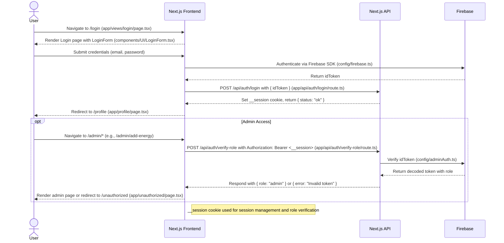

# Login System Documentation (solarfarm_ui)

## Overview

The login system in the `solarfarm_ui` Next.js application (version 15.0.1) provides secure user authentication and role-based access control for the `EnergyContract` energy trading platform. It leverages **Firebase Authentication** for user management, **Next.js API routes** for session handling, and a secure cookie (`__session`) to maintain user sessions. The system supports user login via the `/login` page, session establishment through `/api/login`, and role verification for admin access via `/api/verify-role`. This document details the login system’s implementation, components, flow, security considerations, and integration with `EnergyContract`.

### Goals

- **Secure Authentication**: Validate user identities using Firebase Authentication.
- **Session Management**: Maintain user sessions with a secure, cookie-based approach.
- **Role-Based Access**: Restrict admin routes (e.g., `/admin/add-energy`, `/admin/update-price`) to users with the `admin` role.
- **Seamless Integration**: Support frontend flows (`/buySolar`, `/profile`) and `EnergyContract` interactions (`utils/contract.js`).
- **Maintainability**: Use modular Next.js components and APIs for scalability.

## Components

### Frontend

- **/login Page** (`app/views/login/page.tsx`): Renders the login interface, handling form submission and redirection.
- **SigningForm.jsx** (`components/UI/LoginForm.tsx`): A reusable component for the login form (email/password input).
- **Firebase SDK** (`config/firebase.ts`): Initializes Firebase client-side and handles authentication (e.g., `signInWithEmailAndPassword`).

### API Routes

- **/api/login** (`app/api/auth/login/route.ts`): Accepts a Firebase ID token and sets the `__session` cookie.
- **/api/verify-role** (`app/api/auth/verify-role/route.ts`): Verifies the user’s role using the `__session` token.

### Firebase

- **Client SDK** (`config/firebase.ts`): Manages client-side authentication.
- **Admin SDK** (`config/adminAuth.ts`): Verifies tokens server-side for role checks.
- **Authentication**: Supports Email/Password and Google authentication.
- **Realtime Database**: Stores role claims (e.g., `role: admin`) and user data.

### Project Structure

```
solarfarm_ui/
├── app/
│   ├── api/
│   │   ├── auth/
│   │   │   ├── login/
│   │   │   │   └── route.ts
│   │   │   ├── verify-role/
│   │   │   │   └── route.ts
│   ├── admin/
│   ├── views/
│   │   └── login/
│   │       └── page.tsx
│   ├── components/
│   │   ├── UI/
│   │   │   ├── LoginForm.tsx
│   │   │   ├── PrimaryButton.tsx
│   ├── profile/
│   ├── unauthorized/
│   ├── layout.tsx
├── config/
│   ├── adminAuth.ts
│   ├── firebase.ts
│   ├── MockV3Interface.json
│   ├── SolarFarmABI.js
├── models/
│   ├── commitedOrders.ts
│   ├── transaction.ts
│   ├── user.ts
├── utils/
│   ├── contract.ts
├── .env
├── package.json
├── tailwind.config.ts
```

## Login Flow

1. **User Navigation**:
    
    - The user navigates to `/login` (`app/views/login/page.tsx`), which renders `LoginForm.tsx`.
    - The form collects email and password inputs.
2. **Client-Side Authentication**:
    
    - On form submission, the frontend calls Firebase’s `signInWithEmailAndPassword` (`config/firebase.ts`).
    - Firebase authenticates the user and returns an `idToken`.
3. **Session Establishment**:
    
    - The frontend sends a `POST` request to `/api/auth/login` with `{ idToken }`.
    - The `/api/auth/login` endpoint sets a `__session` cookie containing the `idToken` with secure attributes:
        - `httpOnly: true`
        - `secure: true` (in production)
        - `sameSite: strict`
        - `maxAge: 86400` (1 day)
    - The API responds with `{ status: "ok" }`, and the frontend redirects to `/profile`.
4. **Role Verification (Admin Access)**:
    
    - For admin routes (e.g., `/admin/add-energy`), the frontend sends the `__session` cookie’s `idToken` to `/api/auth/verify-role` in a `GET` or `POST` request.
    - The `/api/auth/verify-role` endpoint verifies the token using Firebase Admin SDK (`config/adminAuth.ts`) and returns `{ role: "admin" }` or `{ role: "user" }`.
    - If `role` is not `admin`, the user is redirected to `/unauthorized`.
5. **Session Persistence**:
    
    - The `__session` cookie is sent with subsequent requests, enabling access to protected routes.
    - After 1 day, the cookie expires, requiring re-authentication.

### Sequence Diagram

The following Mermaid sequence diagram visualizes the login flow, stored as `docs/diagrams/login-flow.mmd`.



## API Endpoints

### /api/auth/login

- **Method**: `POST`
- **Request**:
    
    ```json
    { "idToken": "<firebase-id-token>" }
    ```
    
- **Response**:
    - **Success (200)**:
        
        ```json
        { "status": "ok" }
        ```
        
        - Sets `__session` cookie.
    - **Error (400)**:
        
        ```json
        { "error": "Missing token" }
        ```
        
- **Purpose**: Sets a session cookie with the Firebase `idToken`.

### /api/auth/verify-role

- **Methods**: `GET`, `POST`
- **Request**:
    - **Header**: `Authorization: Bearer <firebase-id-token>`
- **Response**:
    - **Success (200)**:
        
        ```json
        { "role": "admin" }
        ```
        
        or
        
        ```json
        { "role": "user" }
        ```
        
    - **Error (401)**:
        
        ```json
        { "error": "No token provided" }
        ```
        
        or
        
        ```json
        { "error": "Invalid token" }
        ```
        
- **Purpose**: Verifies the user’s role for access control.

## Setup Instructions

1. **Firebase Configuration**:
    
    - Create a Firebase project at [console.firebase.google.com](https://console.firebase.google.com/).
    - Enable Email/Password and/or Google authentication.
    - Create a Realtime Database with rules:
        
        ```json
        {
          "rules": {
            ".read": "auth != null",
            ".write": "auth != null"
          }
        }
        ```
        
    - Save the Admin SDK service account key as `solarfarm_ui/solarfarmsystem-firebase-adminsdk-fbsvc-b3714a635d.json`.
    - Configure `solarfarm_ui/.env`:
        
        ```plaintext
        NEXT_PUBLIC_FIREBASE_API_KEY=your-api-key
        NEXT_PUBLIC_FIREBASE_AUTH_DOMAIN=your-auth-domain.firebaseapp.com
        NEXT_PUBLIC_FIREBASE_DATABASE_URL=https://your-database-name.firebaseio.com
        NEXT_PUBLIC_FIREBASE_PROJECT_ID=your-project-id
        NEXT_PUBLIC_FIREBASE_STORAGE_BUCKET=your-storage-bucket.appspot.com
        NEXT_PUBLIC_FIREBASE_MESSAGING_SENDER_ID=your-messaging-sender-id
        NEXT_PUBLIC_FIREBASE_APP_ID=your-app-id
        FIREBASE_PROJECT_ID=your-project-id
        FIREBASE_PRIVATE_KEY=your-private-key
        FIREBASE_CLIENT_EMAIL=your-client-email
        ```
        
2. **Install Dependencies**:
    
    ```bash
    cd solarfarm_ui
    npm install
    ```
    
3. **Run the Application**:
    
    ```bash
    npm run dev
    ```
    
    Access at `http://localhost:3000`.
    
4. **Secure Files**:
    
    - Update `.gitignore`:
        
        ```plaintext
        solarfarm_ui/.env
        solarfarm_ui/*.json
        ```
        

## Testing Instructions

### Manual Testing

1. **Login Flow**:
    
    - Navigate to `http://localhost:3000/login`.
    - Enter valid credentials; verify redirection to `/profile`.
    - Inspect browser developer tools for `__session` cookie (attributes: `httpOnly`, `maxAge=86400`).
    - Test invalid credentials; expect error message in `LoginForm.tsx`.
2. **Role Verification**:
    
    - Log in as an admin (set `role: admin` via `setInitialAdmin.ts` or Firebase Console).
    - Access `/admin/add-energy`; verify page loads.
    - Log in as a non-admin; expect redirection to `/unauthorized`.
    - Use Postman to test `/api/auth/verify-role`:
        
        ```bash
        curl -H "Authorization: Bearer <idToken>" http://localhost:3000/api/auth/verify-role
        ```
        
3. **API Testing**:
    
    - **/api/auth/login**:
        
        ```bash
        curl -X POST -H "Content-Type: application/json" -d '{"idToken": "<firebase-id-token>"}' http://localhost:3000/api/auth/login
        ```
        
        - Expect: `200`, `{ "status": "ok" }`, `__session` cookie.
    - **/api/auth/verify-role**:
        - Expect: `200`, `{ "role": "admin" }` or `401`, `{ "error": "Invalid token" }`.

### Automated Testing

- Add Jest/Playwright tests in `solarfarm_ui/tests/`:
    
    ```javascript
    // solarfarm_ui/tests/login.test.ts
    const fetch = require('node-fetch');
    
    describe('POST /api/auth/login', () => {
      it('sets __session cookie', async () => {
        const response = await fetch('http://localhost:3000/api/auth/login', {
          method: 'POST',
          headers: { 'Content-Type': 'application/json' },
          body: JSON.stringify({ idToken: '<valid-id-token>' }),
        });
        expect(response.status).toBe(200);
        expect(response.headers.get('set-cookie')).toContain('__session');
      });
    });
    ```
    
- Run tests:
    
    ```bash
    npm test
    ```
    

## Integration with EnergyContract

- **User Flows**: Enables authenticated users to purchase energy (`/buySolar`) and view orders (`/orders`), interacting with `EnergyContract` (`utils/contract.ts`).
- **Admin Flows**: Restricts `addEnergy` and `updatePrice` to admins, verified via `/api/auth/verify-role`.
- **Diagrams**: Visualized in `docs/diagrams/login-flow.mmd`, `purchase-energy-flow.mmd`, `add-energy-flow.mmd`, and `update-price-flow.mmd`.

## Security Considerations

- **Firebase**:
    - Protect `solarfarm_ui/.env` and `solarfarmsystem-firebase-adminsdk-fbsvc-b3714a635d.json`.
    - Enforce authentication rules in Firebase Console.
- **Cookies**:
    - `__session` is `httpOnly` and `secure` (in production), but consider shorter `maxAge` (e.g., 1 hour).
- **Token Verification**:
    - Add server-side `idToken` verification in `/api/auth/login` using `adminAuth.verifyIdToken`.
- **Rate Limiting**:
    - Apply to `/api/auth/login` and `/api/auth/verify-role` to prevent abuse.
- **Logging**:
    - Replace console logs in `/api/auth/verify-role` with a production logging service.

## Contributing Guidelines

1. **Enhancements**:
    - Add server-side verification to `/api/auth/login`.
    - Implement logout functionality (clear `__session` cookie).
2. **Testing**:
    - Add automated tests for login flow.
    - Update `docs/diagrams/login-flow.mmd` for changes.
3. **PR Process**:
    - Branch: `git checkout -b feature/login-update`.
    - Commit: `git commit -m "Update login system"`.
    - Open PR against `main`.

## Notes

- **AI Assistance**:
    - Components (`LoginForm.tsx`) and APIs were designed with AI tools (e.g., Grok), validated manually.
- **Diagrams**:
    - Store `login-flow.mmd` in `docs/diagrams/` and reference in `docs/ARCHITECTURE.md`.